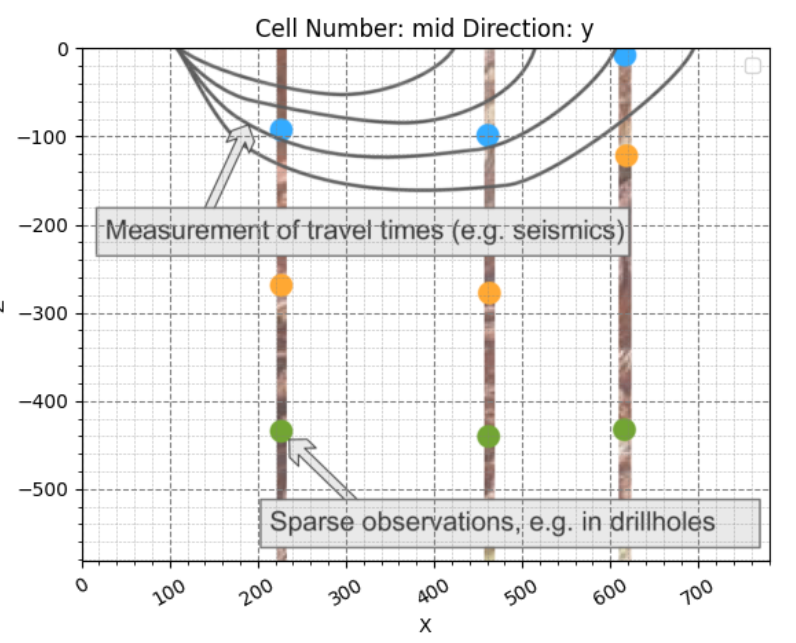

## `get_start..ipynb`代码解读

官方文档：https://docs.gempy.org/tutorials/a_getting_started/get_started.html#sphx-glr-download-tutorials-a-getting-started-get-started-py

### 1.配置Jupyter Notebook中绘图环境
``` python
%matplotlib inline 
from pyvista import set_plot_theme  #导入pyvista的set_plot_theme模块
set_plot_theme('document') #设置pyvista 生成的所有 3D 图形的主题
```

### 2.导入库
```python
import os

os.environ["DEFAULT_BACKEND"] = "PYTORCH"

# Importing GemPy and viewer
import gempy as gp
import gempy_viewer as gpv

# Auxiliary libraries
import numpy as np
import matplotlib.pyplot as plt
import matplotlib.image as mpimg

# sphinx_gallery_thumbnail_number = 11
```

### 3.模型范围计算
`boreholes_concept.png`图像如下
{width=500px}

```python
img = mpimg.imread('boreholes_concept.png')
plt.imshow(img, origin='upper', alpha=.8) #设置坐标原点和不透明度
img.shape[:2] #获取图片的尺寸
```

### 4.设置三维模型属性
```python
geo_model = gp.create_geomodel(
    project_name='Model1', #模型名称
    extent=[0, 780, -200, 200, -582, 0], #模型边界
    resolution=(50, 50, 50), #模型分辨率
    # refinement=4, # We will use octrees
    structural_frame=gp.data.StructuralFrame.initialize_default_structure() #初始化并分配模型的结构框架
)
```
这里的体素是长方体体素，因为地质建模中，地表面积往往很大而深度较小，允许xy方向上的分辨率较大从而减少计算量。

### 5.模型的三维结构
- **模型属性**
```python
geo_model.grid
```

**`out:`**
```python
Grid(values=array([[   7.8 , -196.  , -576.18], #模型中所有计算点（体元中心）的三维坐标
                    [   7.8 , -196.  , -564.54],
                    [   7.8 , -196.  , -552.9 ],
                    ...,
                    [ 772.2 ,  196.  ,  -29.1 ],
                    [ 772.2 ,  196.  ,  -17.46],
                    [ 772.2 ,  196.  ,   -5.82]]), 
       length=array([], dtype=float64), 
       _octree_grid=None,   #指示模型是否使用了八叉树（Octree）网格。
       _dense_grid=RegularGrid(  #这是一个嵌套的 RegularGrid 对象，它存储了规则网格的所有详细配置和数据
        resolution=array([50, 50, 50]), #分辨率
        extent=array([   0.,  780., -200.,  200., -582.,    0.]), #模型空间范围
        values=array([[   7.8 , -196.  , -576.18],  #网格点坐标
                        [   7.8 , -196.  , -564.54],
                        [   7.8 , -196.  , -552.9 ],
                        ...,
                        [ 772.2 ,  196.  ,  -29.1 ],
                        [ 772.2 ,  196.  ,  -17.46],
                        [ 772.2 ,  196.  ,   -5.82]]), 
        mask_topo=array([], shape=(0, 3), dtype=bool), 
        _transform=None), 
       _custom_grid=None, #指示是否使用了用户自定义的网格点。
       _topography=None, #指示模型是否包含了地形数据。
       _sections=None, #指示模型是否定义了额外的二维切片（除了主切片，例如沿X或Y方向的任意剖面）。
       _centered_grid=None, #存储中心化的网格数据
       _transform=None, #这是 Grid 对象的顶层坐标变换参数。
       _octree_levels=-1) #指示八叉树的细化级别。
```

- **模型地层组**
```python
geo_model.structural_frame
```

**out:**
{width=100%}

- **模型默认地层组里面的地层元素**
```python
geo_model.structural_frame.structural_elements
```

**out:**
```python
[Element(
    name=surface1, #名称
    color=#015482, #颜色
    is_active=True #是否活动
), Element(
    name=basement,
    color=#9f0052,
    is_active=True
)]
```

- **修改地层面属性**
```python
geo_model.structural_frame.structural_elements[0].color = '#33ABFF'  # Set 'surface 1' color to blue.
geo_model.structural_frame.structural_elements[1].color = '#570987'  # Set basement color to purple.

geo_model.structural_frame.structural_elements[0].name = 'Limestone'  # Renaming 'surface 1' to 'Limestone'.
geo_model.structural_frame.structural_elements[0]
```
因为这里只有一个地层组，所以可以直接访问。当模型变得更复杂，并且创建了多个结构组时，就需要精确地操作某个特定组内的元素。

- **修改地层组属性**
```python
geo_model.structural_frame.structural_groups[0].name = 'Deposit. Series'
```

### 6.手动输入数据

- **剖面图贴图**
```python
# 1. 初始化一个2D绘图对象，但不立即显示
p2d = gpv.plot_2d(geo_model, show=False)

# 2. 将之前加载的剖面图图像叠加到绘图上，并指定其在模型坐标系中的位置
p2d.axes[0].imshow(img, origin='upper', alpha=.8, extent=(0, 780, -582, 0))

# 3. 启用并自定义网格线，以便精确读取坐标
# Enable grid with minor ticks
p2d.axes[0].grid(which='both')  # 同时启用主要和次要网格线
p2d.axes[0].minorticks_on()  # 确保次要刻度线可见

# Customize the appearance of the grid if needed
p2d.axes[0].grid(which='major', linestyle='--', linewidth='0.8', color='gray') # 主要网格线：虚线，粗，灰色
p2d.axes[0].grid(which='minor', linestyle=':', linewidth='0.4', color='gray') # 次要网格线：点线，细，灰色

# 4. 显示最终的图表
plt.show()
```

**out**


- **输入地质点**
```python
gp.add_surface_points(
    geo_model=geo_model,
    x=[225, 460, 617],
    y=[0, 0, 0],
    z=[-95, -100, -10],
    elements_names=['Limestone', 'Limestone', 'Limestone']
)

p2d = gpv.plot_2d(geo_model, show=False)
p2d.axes[0].imshow(img, origin='upper', alpha=.8, extent=(0, 780, -582, 0))

# Enable grid with minor ticks
p2d.axes[0].grid(which='both')  # Enable both major and minor grids
p2d.axes[0].minorticks_on()  # Enable minor ticks

# Customize the appearance of the grid if needed
p2d.axes[0].grid(which='major', linestyle='--', linewidth='0.8', color='gray')
p2d.axes[0].grid(which='minor', linestyle=':', linewidth='0.4', color='gray')

plt.show()
```
可以同时输入多个地质点
**out**


- **输入产状点**
```python
gp.add_orientations(
    geo_model=geo_model,
    x=[350],
    y=[0],
    z=[-120],
    elements_names=['Limestone'],
    pole_vector=[np.array([0, 0, 1])]
)

p2d = gpv.plot_2d(geo_model, show=False)
p2d.axes[0].imshow(img, origin='upper', alpha=.8, extent=(0, 780, -582, 0))

# Enable grid with minor ticks
p2d.axes[0].grid(which='both')  # Enable both major and minor grids
p2d.axes[0].minorticks_on()  # Enable minor ticks

# Customize the appearance of the grid if needed
p2d.axes[0].grid(which='major', linestyle='--', linewidth='0.8', color='gray')
p2d.axes[0].grid(which='minor', linestyle=':', linewidth='0.4', color='gray')

plt.show()
```
**out:**


注意！GemPy的建模需要一下最少数据：
- 结构组至少有一个曲面的两个地质点
- 结构组至少一个产状点

#### 模型计算
```python
#确保模型在插值时不会应用任何特殊的全局各向异性假设，保持插值行为在所有方向上的一致性。
geo_model.update_transform(gp.data.GlobalAnisotropy.NONE)

#执行地质模型构建算法。
#engine_config用于设置 GemPy 计算引擎的行为,已经通过环境变量设置了默认值
gp.compute_model(geo_model, engine_config=gp.data.GemPyEngineConfig())
```

#### 2D可视化
```python
gpv.plot_2d(geo_model, cell_number='mid')

p2d = gpv.plot_2d(geo_model, show=False)
p2d.axes[0].imshow(img, origin='upper', alpha=.8, extent=(0, 780, -582, 0))

# Enable grid with minor ticks
p2d.axes[0].grid(which='both')  # Enable both major and minor grids
p2d.axes[0].minorticks_on()  # Enable minor ticks

# Customize the appearance of the grid if needed
p2d.axes[0].grid(which='major', linestyle='--', linewidth='0.8', color='gray')
p2d.axes[0].grid(which='minor', linestyle=':', linewidth='0.4', color='gray')

plt.show()
```

**out:**


#### 3D可视化
```python
gpv.plot_3d(geo_model, show_surfaces=True, image=False)
```
**out**


### 7.标量场

#### 7.1 单个结构组的标量场
```
p2d = gpv.plot_2d(
    model=geo_model,
    series_n=0,
    show_data=True,
    show_scalar=True,
    show_lith=False  #不显示岩性
)

plt.show()
```

**out:**


#### 添加其他地层
```python
#添加第二个地层
element2 = gp.data.StructuralElement(
    name='Siltstone',
    color='#FFA833',  # color=next(geo_model.structural_frame.color_generator),
    surface_points=gp.data.SurfacePointsTable.from_arrays(
        x=np.array([460]),
        y=np.array([0]),
        z=np.array([-280]),
        names='Siltstone'
    ),
    orientations=gp.data.OrientationsTable.initialize_empty()
)

geo_model.structural_frame.structural_groups[0].append_element(element2)

gp.add_surface_points(
    geo_model=geo_model,
    x=[225],
    y=[0],
    z=[-270],
    elements_names=['Siltstone']
)

#添加第三个地层
element3 = gp.data.StructuralElement(
    name='Sandstone',
    color='#72A533',  # next(geo_model.structural_frame.color_generator),
    surface_points=gp.data.SurfacePointsTable.from_arrays(
        x=np.array([225, 460]),
        y=np.array([0, 0]),
        z=np.array([-436, -441]),
        names='Sandstone'
    ),
    orientations=gp.data.OrientationsTable.initialize_empty()
)

geo_model.structural_frame.structural_groups[0].append_element(element3)

#更新模型
gp.compute_model(geo_model)

#贴图
p2d = gpv.plot_2d(geo_model, show=False)
p2d.axes[0].imshow(img, origin='upper', alpha=.8, extent=(0, 780, -582, 0))

# Enable grid with minor ticks
p2d.axes[0].grid(which='both')  # Enable both major and minor grids
p2d.axes[0].minorticks_on()  # Enable minor ticks

# Customize the appearance of the grid if needed
p2d.axes[0].grid(which='major', linestyle='--', linewidth='0.8', color='gray')
p2d.axes[0].grid(which='minor', linestyle=':', linewidth='0.4', color='gray')

plt.show()

#3D可视化
gpv.plot_3d(geo_model, show_surfaces=True, image=False)
```

**out:**


### 8.组合标量场

#### 设置结构组
```python
#设置结构元素
element_discont = gp.data.StructuralElement(
    name='Discont_Surface',
    color='#990000',  # next(geo_model.structural_frame.color_generator),
    surface_points=gp.data.SurfacePointsTable.from_arrays(
        x=np.array([550, 650]),
        y=np.array([0, 0]),
        z=np.array([-30, -200]),
        names='Discont_Surface'
    ),
    orientations=gp.data.OrientationsTable.from_arrays(
        x=np.array([600]),
        y=np.array([0]),
        z=np.array([-100]),
        G_x=np.array([.3]),
        G_y=np.array([0]),
        G_z=np.array([.3]),
        names='Discont_Surface'
    )
)

#设置结构组，
group_discont = gp.data.StructuralGroup(
    name='Discontinuity',
    elements=[element_discont],
    structural_relation=gp.data.StackRelationType.ERODE,
)

#将新建的element_discount插入新建的组中
geo_model.structural_frame.insert_group(0, group_discont)

#可视化结构框架
geo_model.structural_frame
```

**out:**


####  标量场可视化
- 沉积层标量场
```python
p2d = gpv.plot_2d(
    model=geo_model,
    series_n=1,  # This setting will now plot the scalar field used for the fault
    show_data=True,
    show_scalar=True,
    show_lith=False
)

plt.show()
```

**out**


- 断层标量场
```python
p2d = gpv.plot_2d(
    model=geo_model,
    series_n=0,  # This setting will plot the scalar field used for the discontinuity.
    show_data=True,
    show_scalar=True,
    show_lith=False
)

plt.show()
```

**out:**


#### 结构组的不同接触
上面两个结构组默认是侵蚀接触。一共用四种接触：
- BASEMENT：将所有较低组视为 basement。
- ERODE：定义侵蚀接触/不整合。
- ONLAP：定义要重叠到较长组的较年轻组。
- FAULT：将组定义为断层。

1. 侵蚀的可视化
```python
#2d可视化
p2d = gpv.plot_2d(geo_model, show=False)
p2d.axes[0].imshow(img, origin='upper', alpha=.8, extent=(0, 780, -582, 0))

# Enable grid with minor ticks
p2d.axes[0].grid(which='both')  # Enable both major and minor grids
p2d.axes[0].minorticks_on()  # Enable minor ticks

# Customize the appearance of the grid if needed
p2d.axes[0].grid(which='major', linestyle='--', linewidth='0.8', color='gray')
p2d.axes[0].grid(which='minor', linestyle=':', linewidth='0.4', color='gray')

plt.show()

#3d可视化
gpv.plot_3d(geo_model, show_surfaces=True, image=False, show_lith=False)
```

**out:**


2. Onlapping接触
```python
geo_model.structural_frame.structural_groups[0].structural_relation = gp.data.StackRelationType.ONLAP

gp.compute_model(geo_model, engine_config=gp.data.GemPyEngineConfig())

p2d = gpv.plot_2d(geo_model, show=False)
p2d.axes[0].imshow(img, origin='upper', alpha=.8, extent=(0, 780, -582, 0))

# Enable grid with minor ticks
p2d.axes[0].grid(which='both')  # Enable both major and minor grids
p2d.axes[0].minorticks_on()  # Enable minor ticks

# Customize the appearance of the grid if needed
p2d.axes[0].grid(which='major', linestyle='--', linewidth='0.8', color='gray')
p2d.axes[0].grid(which='minor', linestyle=':', linewidth='0.4', color='gray')

plt.show()

gpv.plot_3d(geo_model, show_surfaces=True, image=False, show_lith=False)
```

**out:**


3. Faults断层接触
```python
geo_model.structural_frame.structural_groups[0].structural_relation = gp.data.StackRelationType.FAULT

#确定断层的结构组
gp.set_is_fault(
    frame=geo_model.structural_frame,
    fault_groups=['Discontinuity']
)
```
新的模型框架
{width=80%}

可视化
```python
gp.compute_model(geo_model, engine_config=gp.data.GemPyEngineConfig())

p2d = gpv.plot_2d(geo_model, show=False)
p2d.axes[0].imshow(img, origin='upper', alpha=.8, extent=(0, 780, -582, 0))

# Enable grid with minor ticks
p2d.axes[0].grid(which='both')  # Enable both major and minor grids
p2d.axes[0].minorticks_on()  # Enable minor ticks

# Customize the appearance of the grid if needed
p2d.axes[0].grid(which='major', linestyle='--', linewidth='0.8', color='gray')
p2d.axes[0].grid(which='minor', linestyle=':', linewidth='0.4', color='gray')

plt.show()

gpv.plot_3d(geo_model, show_surfaces=True, image=False, show_lith=False)

#标量场可视化
p2d = gpv.plot_2d(
    model=geo_model,
    series_n=1,  # This will plot the scalar field used for the fault
    show_data=True,
    show_scalar=True,
    show_lith=False
)

plt.show()
```


### 9.地形和地质图
在 GemPy 中，我们可以添加更多网格类型以用于不同目的，例如为我们的模型添加地形。在以下部分中， 我们将通过创建一个随机地形网格来举例说明这一点，该网格允许我们与表面相交并计算高分辨率 地质图。
```python
gp.set_topography_from_random(
    grid=geo_model.grid, #输入规则格网
    fractal_dimension=1.9, #设置生成地形的粗糙度
    d_z=np.array([-150, 0]), #生成地层的垂直高度
    topography_resolution=np.array([200, 200]) #生成地层的分辨率
)

#2D可视化
gpv.plot_2d(geo_model, show_topography=True)

#3D可视化
gpv.plot_3d(geo_model, show_surfaces=True, image=False, show_topography=True, show_lith=False)
```
**out**:


更新模型
```python
gp.compute_model(geo_model)

gpv.plot_2d(geo_model, section_names=['topography'], show_topography=True)

gpv.plot_3d(geo_model, show_surfaces=True, image=False, show_topography=True)
```
**out:**


### 10.模型提取
```python
#提取第一个地层面的所有点
#dc_meshes`: 是一个列表，存储了使用 Dual Contouring（双等值线）算法生成的每个地质表面的网格数据。
vertices_0 = geo_model.solutions.dc_meshes[0].vertices

#提取第一个地层面所有面
edges_0 = geo_model.solutions.dc_meshes[0].edges
print(type(vertices_0), vertices_0, edges_0)
```

out:
```python
<class 'numpy.ndarray'> [[ 0.45129359 -0.23915722 -0.63081408]
 [ 0.43619337 -0.23915722 -0.58985021]
 [ 0.45123358 -0.20726947 -0.63101987]
 ...
 [ 0.21781076  0.2072733  -0.04150489]
 [ 0.23731025  0.23916798 -0.07939452]
 [ 0.21703678  0.23916084 -0.04243479]] 
 
 [[  3   1   2]
 [  8   6   3]
 [  9   7   8]
 ...
 [316 314 313]
 [318 323 314]
 [327 325 323]]
 ```
我们可以看到，此网格的顶点以 Numpy 数组的形式返回，每个顶点的 x、y 和 z 位置值。但是，这些值与我们的模型范围不对应。那是因为它们已经在 GemPy 中进行了转换。要返回与原始坐标系对应的值，我们可以按如下方式反转此转换：

```python
geo_model.input_transform.apply_inverse(vertices_0)
```

out:
```python
array([[ 774.81417593, -187.49925971, -559.55823517],
       [ 762.97560303, -187.49926005, -527.44256826],
       [ 774.76712736, -162.49926701, -559.71957915],
       ...,
       [ 591.76363561,  162.50226762,  -97.53983597],
       [ 607.05123778,  187.5076957 , -127.24530088],
       [ 591.15683725,  187.50209584,  -98.26887806]], 
       shape=(338, 3))
```

####提取和重塑岩性块数据
```python
lith_block = geo_model.solutions.raw_arrays.lith_block
# `geo_model.solutions.raw_arrays`: 包含了模型计算后的各种原始数组结果。
# `.lith_block`: 这是一个一维的 NumPy 数组，存储了模型中每个体元（voxel）所分配的**岩性 ID**。
#              每个 ID 对应一个特定的地层或单元（例如，1 可能代表 Limestone，2 代表 Siltstone）。
#              体元通常按顺序（例如 Z-Y-X 或 X-Y-Z）展平为一维数组。

print(lith_block.shape, lith_block)
# 打印 `lith_block` 的原始形状（应该是一个一维数组，例如 (125000,)）和其内容。

lith_block = lith_block.reshape(50, 50, 50)
# `.reshape(50, 50, 50)`: 将一维的 `lith_block` 数组**重塑**为一个三维数组。
#                      重塑的维度 (50, 50, 50) 应该与您在 `geo_model` 初始化时定义的 `resolution` 一致。
#                      重塑后，`lith_block` 将成为一个代表整个三维模型的体元网格，每个元素是对应体元的岩性 ID。

print(lith_block.shape, lith_block)
# 打印重塑后的 `lith_block` 的形状（现在是 (50, 50, 50)）和其内容。
# 这让您可以以三维结构来访问和分析岩性数据。
```

#### 访问原始网格坐标和地形网格坐标
```python
geo_model.grid.regular_grid.values
# `geo_model.grid`: 访问模型中定义的网格对象。
# `.regular_grid`: 访问 Grid 对象内部的规则网格数据（因为您设置了 resolution，所以有这个属性）。
# `.values`: 提取规则网格中所有体元（或网格点）的原始三维坐标。
#           这与 `geo_model.grid.values` 是同一个数组，只是这里通过 `regular_grid` 属性明确了是规则网格的坐标。

geo_model.grid.topography.values
# `geo_model.grid.topography`: 访问模型中定义的地形数据（如果您之前通过 `set_topography_from_random` 等函数设置了地形）。
# `.values`: 提取地形网格中所有点的高程坐标（通常是 (X, Y, Z_height)）。
#           这个数组通常是 (N, 3) 的形状，N 是地形分辨率的乘积。
```


